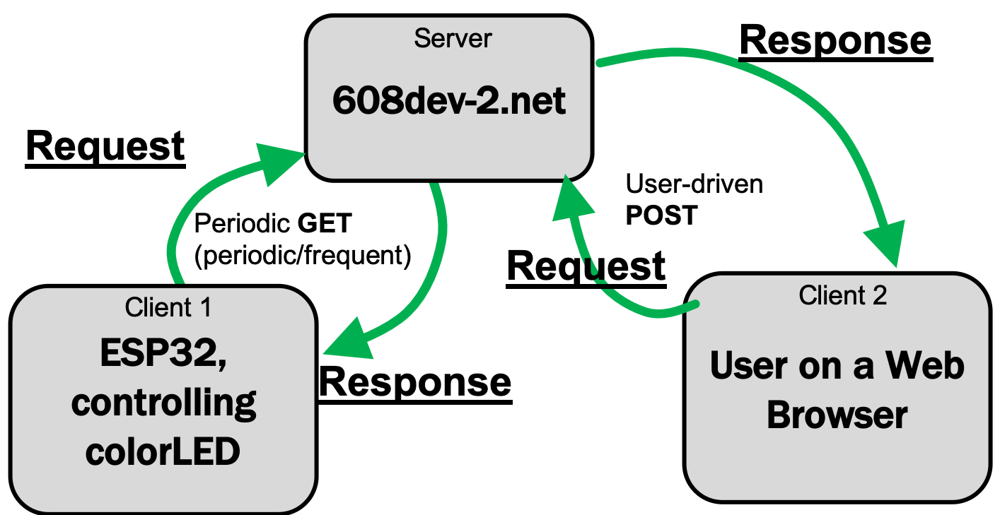

# Esfir: web-controlled smart lamp

An ESP32 RGB lamp whose colour is set from a web page. The page writes the chosen colour to a database on a server. The ESP32 polls that server and drives an RGB LED with PWM. This was a design exercise for MIT **6.08** (Interconnected Embedded Systems), spring 2022.

🎥 Demo: https://youtu.be/NfWi4lIguIc



## How it works

There are three pieces: the **web UI**, the **server and database**, and the **ESP32 client**.

```
browser ──POST r,g,b──▶ home.py ──INSERT──▶ colors_table (SQLite)
                                                   │
ESP32 ◀──"r,g,b"── server.py ◀──SELECT latest──────┘   (GET every 5 s)
```

### Web UI (`software/server/home.py`)

- `home.py` serves an HTML form with colour inputs. The HTML is embedded in the script, and Bootstrap and jQuery load from a CDN. `web/home.html` holds a standalone copy of the page.
- Submitting the form POSTs to `home.py`. The script parses the red, green and blue values and inserts a row into the database.

### Database

An SQLite table `colors_table (red int, green int, blue int, timing timestamp)`. Every POST adds a row.

### Server endpoint for the ESP32 (`software/server/server.py`)

A `GET` returns the most recent row (`ORDER BY timing DESC`) as the plain string `"r,g,b"`. It returns `0,0,0` if the table is empty.

### ESP32 client (`firmware/smart_lamp/`)

- Every `RESPONSE_INTERVAL` (5000 ms) the ESP32 sends a GET to `server.py` and parses `r,g,b`.
- Each channel drives an LEDC PWM channel: 10 kHz, 8-bit, on **GPIO 2 (R), 3 (G) and 4 (B)**.
- The LED is common-anode (active low), so the firmware writes `255 − value`.
- Green looked much brighter than the other colours at equal values, so it is scaled by **0.9** to balance the mix.

## Repository layout

| Path | What |
|---|---|
| `firmware/smart_lamp/smart_lamp.ino` | Main sketch: Wi-Fi, polling, PWM |
| `firmware/smart_lamp/support_functions.ino` | HTTP request helper (from the 6.08 exercises) |
| `software/server/home.py` | Web UI and POST handler |
| `software/server/server.py` | ESP32 GET endpoint |
| `software/server/web/home.html` | The UI page as a standalone file |
| `docs/images/smart_lamp.png` | System diagram |

## Running it yourself

1. **Server:** both scripts use the 6.08 server convention. The server calls `request_handler(request)` with `request["method"]`, `["form"]` and `["values"]`. The database path is hard-coded to `/var/jail/home/ahmadtak/server/colors_database.db`, so change `COLORS_DATABASE` in both files, then host them behind any small Python web framework (a Flask wrapper is about 10 lines).
2. **Firmware:** open `smart_lamp.ino` in the Arduino IDE with the ESP32 board package installed. Set `NETWORK` and `PASSWORD`, point the request host and path at your server, and upload.
3. Wire a common-anode RGB LED, with resistors, to GPIO 2, 3 and 4.

## License

MIT; see [LICENSE](LICENSE).
